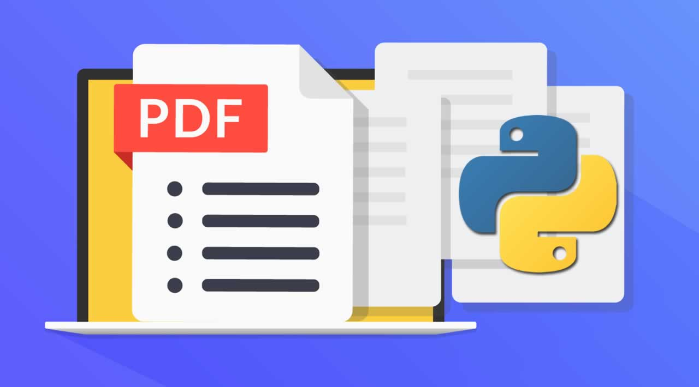

# Business-Intelligence

Business intelligence (BI) leverages software and services to transform data into actionable insights that inform an organization’s strategic and tactical business decisions. 

Below are some piece of software developed by me for this purpose.

## Document AI

**Document AI** ( Google Cloud Plataform) is a document understanding platform that takes unstructured data from documents and transforms it into structured data, making it easier to understand, analyze, and consume. It uses machine learning and Google Cloud to help you create scalable, end-to-end, cloud-based document processing applications. 

* [Medium article](https://medium.com/@pierrebomfim/como-extrair-dados-de-um-documento-com-o-google-document-ai-fba3eaf8f65f)
* [Colab Notebook](https://colab.research.google.com/drive/1AYelssPzeytUQHM9b04oA9qSRBWzpYCw?usp=sharing)

## Write and read XSML files

**Opempyxl** openpyxl is a Python library to read/write Excel 2010 xlsx/xlsm/xltx/xltm files. It was born from lack of existing library to read/write natively from Python the Office Open XML format.

* [Medium article]('')
* [Colab Notebook](https://colab.research.google.com/drive/1qqeZuqvC559jvvrLNZDhrUVHG-a2JXwk?usp=sharing)

## Extract data from PDF files

**PDFPlumber** is a python library to plumb a PDF for detailed information about each text character, rectangle, and line.

* [Medium article](https://medium.com/@pierrebomfim/the-easiest-way-to-extract-data-from-a-pdf-file-using-python-b67d301a4499)
* [Colab Notebook](https://colab.research.google.com/drive/1qDH9912u6c9WRaDhtAux6QSF2-VxMVxP?usp=sharing)

